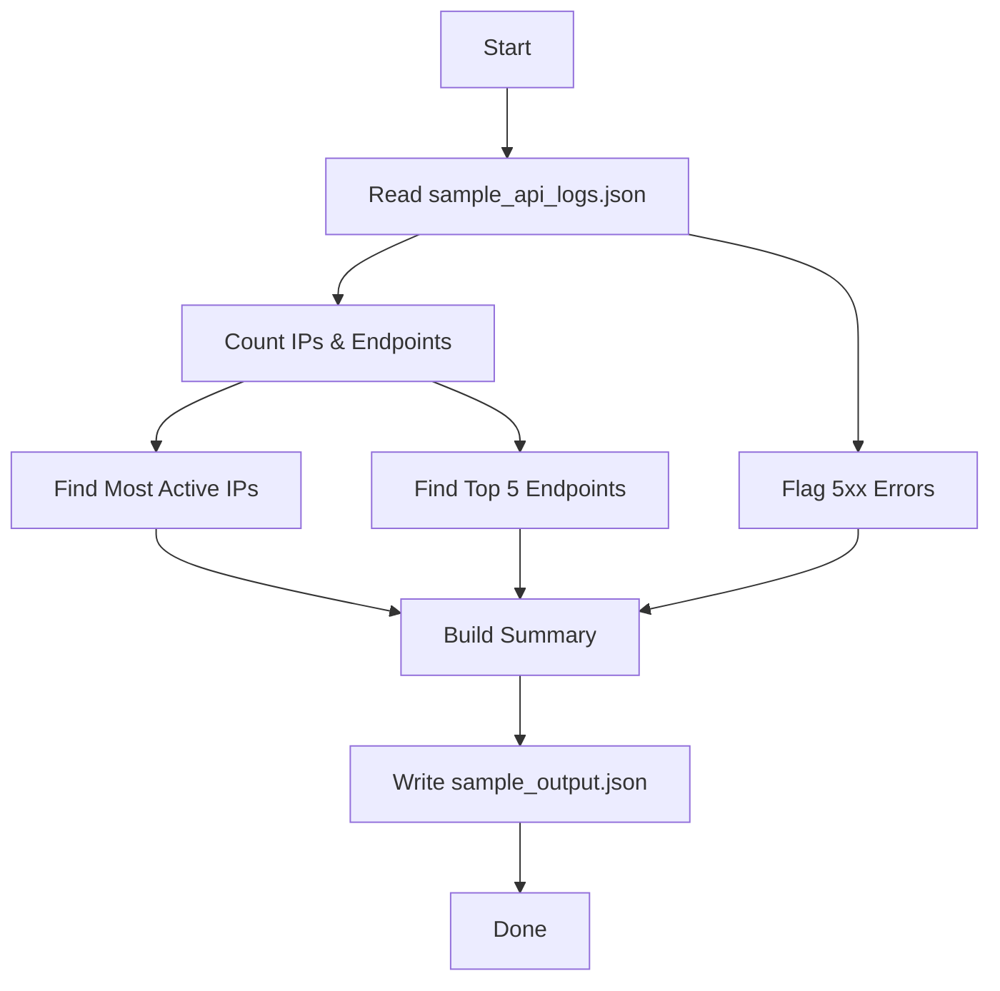

# API Logs Analyzer

## Overview
This project analyzes API logs to:
- Find the most active IPs
- Detect the top 5 API endpoints
- Flag 5xx response codes
- Output a summary in JSON format

## Workflow Diagram



## Instructions

1. Place your `sample_api_logs.json` file in the project directory.
2. Make sure your `package.json` has:
   - `"type": "module"` (for ES module support)
   - The script entry: `"start": "node analyze_logs.js"`
3. Run the script:
   ```sh
   npm start
   ```
   or
   ```sh
   node analyze_logs.js
   ```
4. The summary will be printed and saved as `SampleOutput.json`.

## Output
- **most_active_ips**: Top IPs by request count.
- **top_endpoints**: Top 5 API endpoints by usage.
- **flagged_5xx_errors**: List of requests with 5xx status codes.

---

Author : Y Sai Koushik Reddy